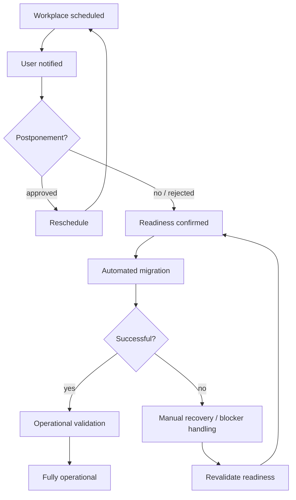

# Enterprise Workplace OS Migration

> **SSAD-based reconstruction of a large-scale enterprise workplace migration from Microsoft Windows to Astra Linux in a banking environment.**


---

## What this case is about

This repository reconstructs a real enterprise migration programme through the **SSAD — System-Structured Analysis Documentation** methodology.

The analytical object is not “install Astra Linux”.

It is the controlled evolution of an employee workplace while preserving the capability to perform required business activity.

```text
User business activity
        ↓
Workplace dependencies
        ↓
Migration readiness
        ↓
Planning / migration wave
        ↓
Execution attempt
        ↓
Exception / recovery if needed
        ↓
Operationally migrated workplace
```

Astra Linux installation alone is therefore not the success criterion.

> **A workplace is successfully migrated only when the agreed working environment is operational and the user can continue the required business workflow.**

---

## Why this is a useful SSAD case

This system is materially different from a conventional software product.

There is no single application boundary containing all behavior. The migration depends on:

- employee workplaces;
- software compatibility;
- corporate access and security constraints;
- migration automation;
- Service Desk coordination;
- multiple support domains;
- migration waves and postponements;
- blockers and vendor remediation;
- manual recovery;
- transitional dual-boot states.

That makes the central analytical question:

> **How do we define one coherent migration model when evidence and capabilities are distributed across many independently owned domains?**

---

## System-shaped knowledge structure

The repository is being reorganized around real responsibility areas rather than artifact types.

```text
system/
├─ cross-system boundary, invariants and synthesis
│
workplace/
├─ workplace meaning and lifecycle state
│
readiness/
├─ aggregate decision: may this workplace migrate safely now?
│
planning/
├─ migration wave, planned date and postponement
│
execution/
├─ actual migration attempts and technical outcomes
│
exceptions/
├─ blockers, remediation and manual recovery
│
integrations/
├─ Service Desk, automation tooling, notifications and support boundaries
│
technical-projection/
└─ hypothetical API / database representation for portfolio purposes
```

Start with [`system/`](system/README.md).

---

## Core responsibility model


### Workplace

Owns what the workplace is and what migration state it is in.

### Readiness

Owns the aggregate decision that current evidence is sufficient to migrate safely.

### Planning

Owns when migration is intended to happen and whether the active schedule has been postponed or superseded.

### Execution

Owns what actually happened during an automated or manual migration attempt.

### Exceptions

Owns deviations from the normal path: blockers, remediation, recovery and return to readiness validation.

### Integrations

Describe facts and capabilities crossing ownership boundaries without re-modeling adjacent systems internally.

---

## Core invariants

```text
Astra installed
!= operational migration complete

MigrationSchedule
!= MigrationAttempt

external evidence
!= internal migration authority

blocked
!= removed from migration programme

dual boot
!= final migrated state

technical API/database projection
!= historical production architecture
```

These invariants are more important than any particular file tree or API shape.

---

## Migration readiness

Migration readiness depends on evidence from several domains:

```text
Business capability required
        ↓
Software compatibility
        ↓
Access / security constraints
        ↓
Infrastructure readiness
        ↓
Known blockers
        ↓
Cross-team evidence
        ↓
READY / NEEDS COORDINATION / BLOCKED
```

Different support groups may be authoritative for their own evidence while the migration model still needs one coherent readiness meaning.

> **Evidence is distributed. System meaning must still be explicit.**

See [`readiness/`](readiness/README.md).

---

## Planning and execution are different facts

One of the important distinctions in this case is:

```text
MigrationSchedule
→ planned migration

MigrationAttempt
→ actual execution
```

This supports:

- repeated rescheduling;
- user postponements;
- failed automated attempts;
- manual recovery;
- complete execution history.

See [`planning/`](planning/README.md) and [`execution/`](execution/README.md).

---

## Normal and exception paths



The blocker/recovery path is a first-class part of the system model, not just “error handling”.

See [`exceptions/`](exceptions/README.md).

---

## External boundaries

Relevant adjacent systems and teams include:

- Service Desk;
- automated migration tooling;
- notification services;
- Information Security;
- Infrastructure Automation;
- Software / Office Applications Support;
- Telephony Support;
- other specialized support domains.

They provide evidence, capabilities or coordination workflows.

The migration analysis does not claim ownership of their internal systems.

See [`integrations/`](integrations/README.md).

---

## Technical projection

The repository also contains a hypothetical portfolio implementation of the reconstructed domain using REST, OpenAPI and PostgreSQL.

This material is useful for demonstrating implementation-aware analysis, but it is **not evidence of the original production architecture**.

```text
Canonical migration knowledge
        ↓
technical projection
        ↓
REST / OpenAPI / SQL
```

See [`technical-projection/`](technical-projection/README.md).

During restructuring, the existing [`api/`](api/), [`sql/`](sql/), [`docs/`](docs/) and [`diagrams/`](diagrams/) directories remain as migration sources. They will be selectively moved, linked or retired after canonical ownership is stabilized.

---

## Existing evidence and models

Useful legacy material currently includes:

- migration context and scope;
- AS-IS workplace environment;
- dependency/readiness model;
- operational business rules;
- requirements and acceptance criteria;
- workplace state model;
- conceptual migration data model;
- migration and postponement sequences;
- dependency, process and state diagrams;
- hypothetical REST/OpenAPI contracts;
- hypothetical PostgreSQL schema and analysis queries.

The restructuring goal is **not to discard this work**. It is to assign each piece of knowledge a canonical owner and remove artifact-type organization as the primary navigation model.

---

## Methodology

This case is being structured with:

**[SSAD — System-Structured Analysis Documentation](https://github.com/branch-danya-dev/ssad-methodology)**

SSAD principle used here:

> **The system determines the knowledge structure. Document types do not.**

---

## Disclaimer

This repository is a sanitized reconstruction of a real enterprise migration case.

Internal names, organization-specific processes, employee data, technical identifiers, infrastructure details and confidential information have been removed, generalized or replaced with synthetic examples.

The repository does not contain original internal documentation, production data, confidential infrastructure information or proprietary source code.

The API, database schema and some detailed contracts are educational portfolio projections created after the real migration experience.

---

## Author

**Daniel Rogulin**  
System Analyst / Enterprise IT

Focus areas:

- enterprise systems;
- system and integration analysis;
- infrastructure transformation;
- requirements engineering;
- technical process decomposition;
- implementation-aware analysis.
