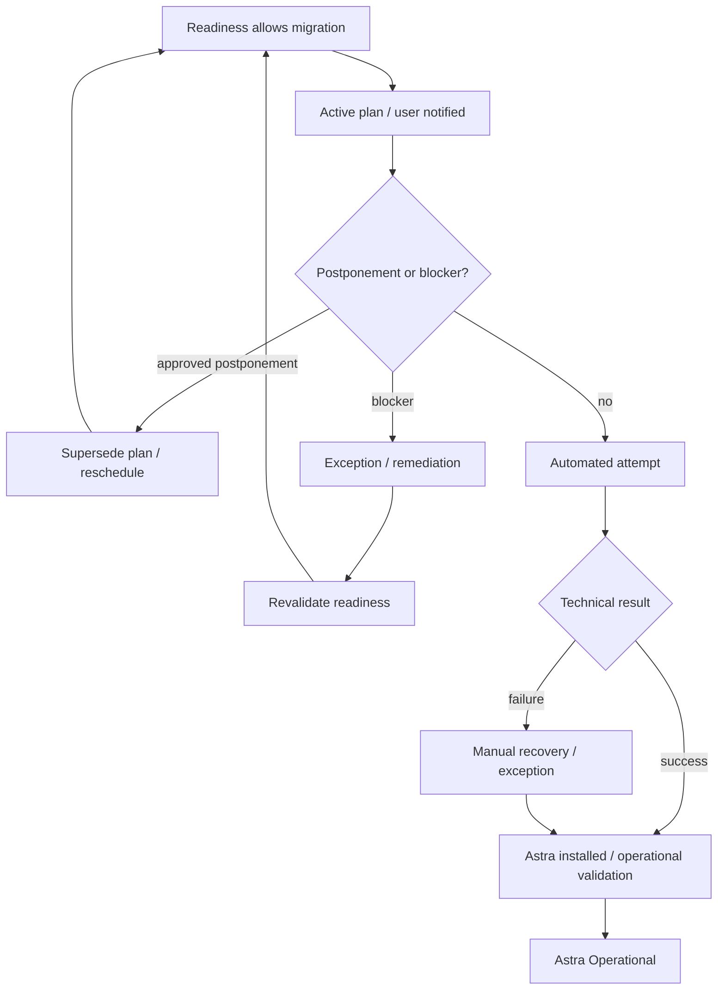

# Enterprise Workplace OS Migration

> **SSAD-based reconstruction of a large-scale enterprise workplace migration from Microsoft Windows to Astra Linux in a banking environment.**


---

## What this case is about

This repository reconstructs a real enterprise migration programme through the **SSAD — System-Structured Analysis Documentation** methodology.

The analytical object is not “install Astra Linux”.

It is the controlled evolution of an employee workplace while preserving the capability to perform required business activity.

```text
User business activity
        ↓
Workplace environment and dependencies
        ↓
Migration readiness
        ↓
Planning / migration wave
        ↓
Execution attempt
        ↓
Exception / recovery if needed
        ↓
Operationally migrated workplace
```

> **A workplace is successfully migrated only when the agreed working environment is operational and the user can continue the required business workflow.**

---

## Why this is a useful SSAD case

This system is materially different from a conventional software product.

There is no single application boundary containing all behavior. The migration depends on:

- heterogeneous employee workplaces;
- software/functionality compatibility;
- corporate access and security constraints;
- migration automation;
- Service Desk coordination;
- multiple independent support domains;
- migration waves and postponements;
- blockers and vendor remediation;
- manual recovery;
- transitional dual-boot states.

The central analytical question is:

> **How do we define one coherent migration model when evidence and capabilities are distributed across many independently owned domains?**

---

## System-shaped knowledge structure

The active analytical knowledge is organized around real responsibility areas rather than artifact types.

```text
system/
├─ cross-system boundary, invariants, data ownership, history and synthesis
│
workplace/
├─ AS-IS workplace profiles, environment meaning and operational states
│
readiness/
├─ dependency evidence and aggregate migration eligibility decision
│
planning/
├─ migration waves, active plans, dates and postponement
│
execution/
├─ actual automated/manual migration attempts and technical outcomes
│
exceptions/
├─ blockers, remediation, transition strategies and recovery
│
integrations/
├─ Service Desk, tooling, notifications and specialized support boundaries
│
technical-projection/
└─ hypothetical API / database representation for portfolio purposes
```

Start with [`system/`](system/README.md).

The previous artifact-oriented `docs/` package has been decomposed into these canonical owners and removed from the active tree. Historical versions remain available in Git history.

---

## Core responsibility model


### [`workplace/`](workplace/README.md)

Owns what environment exists and whether the workplace is operational. It also preserves the real AS-IS variability of office, remote, restricted, developer and specialized workplace profiles.

### [`readiness/`](readiness/README.md)

Owns the aggregate decision that current evidence is sufficient to migrate safely.

### [`planning/`](planning/README.md)

Owns when migration is intended to happen and whether an active plan has been postponed or superseded.

### [`execution/`](execution/README.md)

Owns what actually happened during a migration attempt.

### [`exceptions/`](exceptions/README.md)

Owns deviations from the normal path: blockers, remediation, manual recovery and return to readiness.

### [`integrations/`](integrations/README.md)

Owns the migration meaning of facts/capabilities crossing external boundaries without re-modeling adjacent systems internally.

---

## The old global status was decomposed

One of the largest changes introduced by the SSAD restructuring is that values such as:

```text
Scheduled
Ready
Blocked
Migration In Progress
Manual Migration Required
Dual Boot
Migrated
```

are no longer assumed to belong to one giant workplace state machine.

They describe different responsibility dimensions:

| Dimension | Question | Owner |
|---|---|---|
| workplace state | what environment exists and is it operational? | `workplace/` |
| readiness | may normal migration proceed? | `readiness/` |
| planning | when is migration intended to happen? | `planning/` |
| execution | what is happening / what happened in an attempt? | `execution/` |
| exception | what unresolved condition changes the normal path? | `exceptions/` |

See [`workplace/states.md`](workplace/states.md) and [`system/data-ownership.md`](system/data-ownership.md).

---

## Core invariants

The detailed canonical list lives in [`system/invariants.md`](system/invariants.md).

Key examples:

```text
Astra installed
!= operational migration complete

MigrationSchedule
!= MigrationAttempt

external evidence
!= internal migration authority

blocked
!= removed from migration programme

dual boot
!= final migrated state

reporting status
!= canonical domain state

technical API/database projection
!= historical production architecture
```

---

## Migration readiness

Readiness consumes evidence from several independently owned areas:

```text
Business capability required
        ↓
Software / functionality evidence
        ↓
Access / security evidence
        ↓
Infrastructure / tooling evidence
        ↓
Known blockers
        ↓
Cross-team evidence
        ↓
GREEN / YELLOW / RED
```

`GREEN / YELLOW / RED` is a time-sensitive decision over current evidence, not an immutable property of the workplace.

> **Evidence is distributed. System meaning must still be explicit.**

See [`readiness/evidence-model.md`](readiness/evidence-model.md) and [`readiness/decision-model.md`](readiness/decision-model.md).

---

## Planning and execution are different facts

```text
MigrationSchedule
→ planned migration

MigrationAttempt
→ actual execution
```

This distinction supports:

- repeated rescheduling;
- user postponements;
- failed automated attempts;
- manual recovery;
- explainable migration history.

See [`planning/scheduling-and-postponement.md`](planning/scheduling-and-postponement.md) and [`execution/attempt-model.md`](execution/attempt-model.md).

---

## Normal and exception paths



The blocker/recovery path is a first-class part of the system model, not just “error handling”.

See [`exceptions/blockers-and-recovery.md`](exceptions/blockers-and-recovery.md).

---

## External boundaries

Relevant adjacent systems and teams include:

- Service Desk;
- automated migration tooling;
- notification services;
- Information Security / access domains;
- Infrastructure Automation;
- Software / Office Applications Support;
- Telephony and other specialized support domains;
- vendor/development teams.

The migration model consumes evidence/capabilities from these domains without claiming ownership of their internals.

See [`integrations/boundary-contracts.md`](integrations/boundary-contracts.md).

---

## Data ownership, history and reporting

The migration knowledge is not organized around one database schema.

[`system/data-ownership.md`](system/data-ownership.md) maps significant facts to their canonical owners.

[`system/history-and-reporting.md`](system/history-and-reporting.md) shows how planning, readiness, execution, exception and workplace facts combine into an explainable timeline and operational reporting views without creating a second source of truth.

---

## Technical projection

The repository also contains a hypothetical portfolio implementation of the reconstructed domain using REST, OpenAPI and PostgreSQL.

This material is useful for demonstrating implementation-aware analysis, but it is **not evidence of the original production architecture**.

```text
Canonical migration knowledge
        ↓
technical projection
        ↓
REST / OpenAPI / SQL
```

See [`technical-projection/`](technical-projection/README.md).

The existing [`api/`](api/) and [`sql/`](sql/) directories are the remaining legacy technical-projection sources and will be normalized in a separate pass. [`diagrams/`](diagrams/) remains presentation infrastructure while its useful visuals are validated against the new canonical model.

---

## Traceability during restructuring

Legacy `BR-*`, `FR-*`, `NFR-*` and `AC-*` identifiers were retained inside the new canonical documents as migration anchors.

They help prove that rules and verification conditions were not lost, but they no longer determine repository structure.

See [`system/legacy-knowledge-map.md`](system/legacy-knowledge-map.md).

---

## Methodology

This case is structured with:

**[SSAD — System-Structured Analysis Documentation](https://github.com/branch-danya-dev/ssad-methodology)**

SSAD principle demonstrated by this restructuring:

> **The system determines the knowledge structure. Document types do not.**

This enterprise case is deliberately different from the Aveli product example and is used to validate whether SSAD survives a distributed migration programme with cross-team ownership and operational state.

---

## Disclaimer

This repository is a sanitized reconstruction of a real enterprise migration case.

Internal names, organization-specific processes, employee data, technical identifiers, infrastructure details and confidential information have been removed, generalized or replaced with synthetic examples.

The repository does not contain original internal documentation, production data, confidential infrastructure information or proprietary source code.

The API, database schema and some detailed contracts are educational portfolio projections created after the real migration experience.

---

## Author

**Daniel Rogulin**  
System Analyst / Enterprise IT

Focus areas:

- enterprise systems;
- system and integration analysis;
- infrastructure transformation;
- requirements engineering;
- technical process decomposition;
- implementation-aware analysis.
