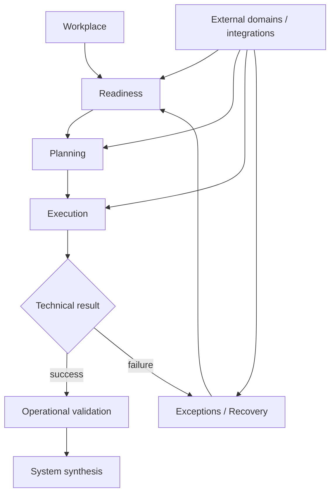

# Enterprise Workplace OS Migration

> **SSAD-based reconstruction of a large-scale enterprise workplace migration from Microsoft Windows to Astra Linux in a banking environment.**


---

## What this case is about

This repository reconstructs a real enterprise migration programme through **SSAD — System-Structured Analysis Documentation**.

The analytical object is not simply “install Astra Linux”. It is the controlled evolution of an employee workplace while preserving the capability to perform required business activity.

```text
User business activity
        ↓
Workplace environment and dependencies
        ↓
Migration readiness
        ↓
Planning / migration wave
        ↓
Execution attempt
        ↓
Exception / recovery if needed
        ↓
Operational validation
        ↓
Operationally migrated workplace
```

> **A workplace is successfully migrated only when the agreed working environment is operational and the user can continue the required business workflow.**

---

## Why this is a useful SSAD case

This system is materially different from a conventional software product.

There is no single application boundary containing all behavior. The migration depends on:

- heterogeneous employee workplaces;
- software/functionality compatibility;
- corporate access and security constraints;
- migration automation;
- Service Desk coordination;
- multiple independent support domains;
- migration waves and postponements;
- blockers and vendor remediation;
- manual recovery;
- transitional dual-boot states.

The central analytical question is:

> **How do we define one coherent migration model when evidence and capabilities are distributed across many independently owned domains?**

---

## System-shaped knowledge structure

```text
system/
├─ cross-system boundary, invariants, data ownership, history and synthesis
│
workplace/
├─ AS-IS profiles, environment meaning and operational states
│
readiness/
├─ dependency evidence and aggregate eligibility decision
│
planning/
├─ migration waves, active plans, dates and postponement
│
execution/
├─ actual automated/manual attempts and technical outcomes
│
exceptions/
├─ blockers, remediation, transition strategies and recovery
│
integrations/
├─ Service Desk, tooling, notifications and specialized support boundaries
│
technical-projection/
├─ synthetic REST / OpenAPI / PostgreSQL representation
│
diagrams/
└─ presentation artifacts pending final validation
```

Start with [`system/`](system/README.md).

The former artifact-oriented `docs/`, `api/` and `sql/` trees have been decomposed or redesigned and removed from the active root. Historical versions remain available in Git history.

---

## Core responsibility model



| Area | Canonical question |
|---|---|
| [`workplace/`](workplace/README.md) | What working environment exists and is it operational? |
| [`readiness/`](readiness/README.md) | May normal migration safely proceed now? |
| [`planning/`](planning/README.md) | When is migration intended to happen? |
| [`execution/`](execution/README.md) | What actually happened during an attempt? |
| [`exceptions/`](exceptions/README.md) | What condition changes the normal path and how is recovery handled? |
| [`integrations/`](integrations/README.md) | What evidence/capabilities cross external ownership boundaries? |

---

## The old global status was decomposed

The original portfolio model used one broad `migration_status` vocabulary containing values such as:

```text
Scheduled
Ready
Blocked
Migration In Progress
Manual Migration Required
Dual Boot
Migrated
```

SSAD exposed that these do not belong to one responsibility.

```text
Workplace environment
Readiness
Planning
Execution
Exceptions
```

A workplace can therefore be represented honestly as:

```text
Environment = Windows Operational
Readiness = RED
Planning = Postponed
Exception = Missing critical software
```

without inventing one giant state machine.

See [`workplace/states.md`](workplace/states.md) and [`system/data-ownership.md`](system/data-ownership.md).

---

## Core invariants

The detailed canonical list lives in [`system/invariants.md`](system/invariants.md).

```text
Astra installed
!= operational migration complete

MigrationSchedule
!= MigrationAttempt

external evidence
!= internal migration authority

blocker resolved
!= readiness automatically GREEN

dual boot
!= final migrated state

derived reporting view
!= canonical domain state

technical projection
!= historical production architecture
```

---

## Readiness is a decision over evidence

```text
Business capability required
        ↓
Software / functionality evidence
        ↓
Access / security evidence
        ↓
Infrastructure / tooling evidence
        ↓
Known blockers
        ↓
Cross-team evidence
        ↓
GREEN / YELLOW / RED
```

`GREEN / YELLOW / RED` is a time-sensitive evaluation, not an immutable workplace property.

> **Evidence is distributed. System meaning must still be explicit.**

See [`readiness/evidence-model.md`](readiness/evidence-model.md) and [`readiness/decision-model.md`](readiness/decision-model.md).

---

## Planning and execution are different histories

```text
MigrationSchedule
→ intention

MigrationAttempt
→ actual execution fact
```

This distinction supports repeated rescheduling, postponements, failed automation, manual recovery and explainable history.

See [`planning/scheduling-and-postponement.md`](planning/scheduling-and-postponement.md) and [`execution/attempt-model.md`](execution/attempt-model.md).

---

## Technical projection

The reconstructed domain is projected into a synthetic implementation model under [`technical-projection/`](technical-projection/README.md).

```text
canonical SSAD knowledge
        ↓
technical projection
        ↓
REST / OpenAPI / PostgreSQL
```

### API

[`technical-projection/api/`](technical-projection/api/README.md) demonstrates an ownership-aware REST projection.

Key corrections from the former API:

- no one global `migrationStatus`;
- schedule requests do not contain `readinessStatus`;
- reschedule / postponement / blocker resolution are explicit operations rather than arbitrary status PATCHes;
- external tooling reports attempt facts rather than directly setting workplace meaning;
- technical success requires separate operational validation;
- `operational-view` is explicitly a derived read model.

Machine-readable contract: [`technical-projection/api/openapi.yaml`](technical-projection/api/openapi.yaml).

### Data

[`technical-projection/data/`](technical-projection/data/README.md) demonstrates a normalized PostgreSQL projection.

Key separation:

```text
workplaces.environment_state
→ Workplace

readiness_evaluations
→ Readiness

migration_schedules
→ Planning

migration_attempts
→ Execution

migration_blockers
→ Exceptions

operational_validations
→ completion verification
```

The database also exposes a derived `workplace_operational_view` for operational reporting without turning that joined representation into a semantic owner.

Files:

- [`schema.sql`](technical-projection/data/schema.sql)
- [`sample-data.sql`](technical-projection/data/sample-data.sql)
- [`analysis-queries.sql`](technical-projection/data/analysis-queries.sql)

---

## External boundaries

Relevant adjacent systems and teams include:

- Service Desk;
- automated migration tooling;
- notification services;
- Information Security / access domains;
- Infrastructure Automation;
- Software / Office Applications Support;
- Telephony and other specialized support domains;
- vendor/development teams.

The migration model consumes evidence and capabilities from these domains without claiming ownership of their internals.

See [`integrations/boundary-contracts.md`](integrations/boundary-contracts.md).

---

## Traceability of the restructuring

Legacy `BR-*`, `FR-*`, `NFR-*` and `AC-*` identifiers remain in canonical documents as historical traceability anchors, not as repository architecture.

The migration audit is documented in [`system/legacy-knowledge-map.md`](system/legacy-knowledge-map.md).

---

## Remaining pass: diagrams

[`diagrams/`](diagrams/) is now the only remaining artifact-oriented area.

The visuals still need to be validated against the current model. In particular, the old global workplace state machine should no longer be presented as canonical because SSAD decomposed it into several responsibility dimensions.

---

## Methodology

This case is structured with:

**[SSAD — System-Structured Analysis Documentation](https://github.com/branch-danya-dev/ssad-methodology)**

> **The system determines the knowledge structure. Document types do not.**

This enterprise migration is deliberately different from the Aveli product case and acts as a second real-world validation of SSAD against distributed ownership, operational evidence and enterprise-scale change.

---

## Disclaimer

This repository is a sanitized reconstruction of a real enterprise migration case.

Internal names, organization-specific processes, employee data, technical identifiers, infrastructure details and confidential information have been removed, generalized or replaced with synthetic examples.

The repository does not contain original internal documentation, production data, confidential infrastructure information or proprietary source code.

The REST API, OpenAPI contract, PostgreSQL schema and detailed technical projections are educational portfolio artifacts created after the real migration experience.

---

## Author

**Daniel Rogulin**  
System Analyst / Enterprise IT

Focus areas:

- enterprise systems;
- system and integration analysis;
- infrastructure transformation;
- requirements engineering;
- technical process decomposition;
- implementation-aware analysis.
