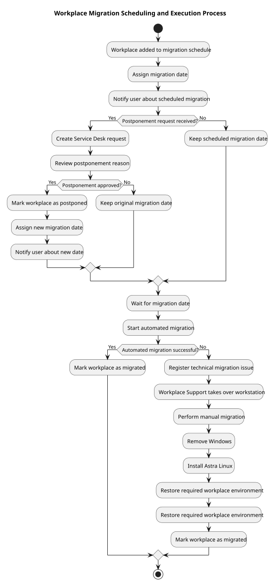
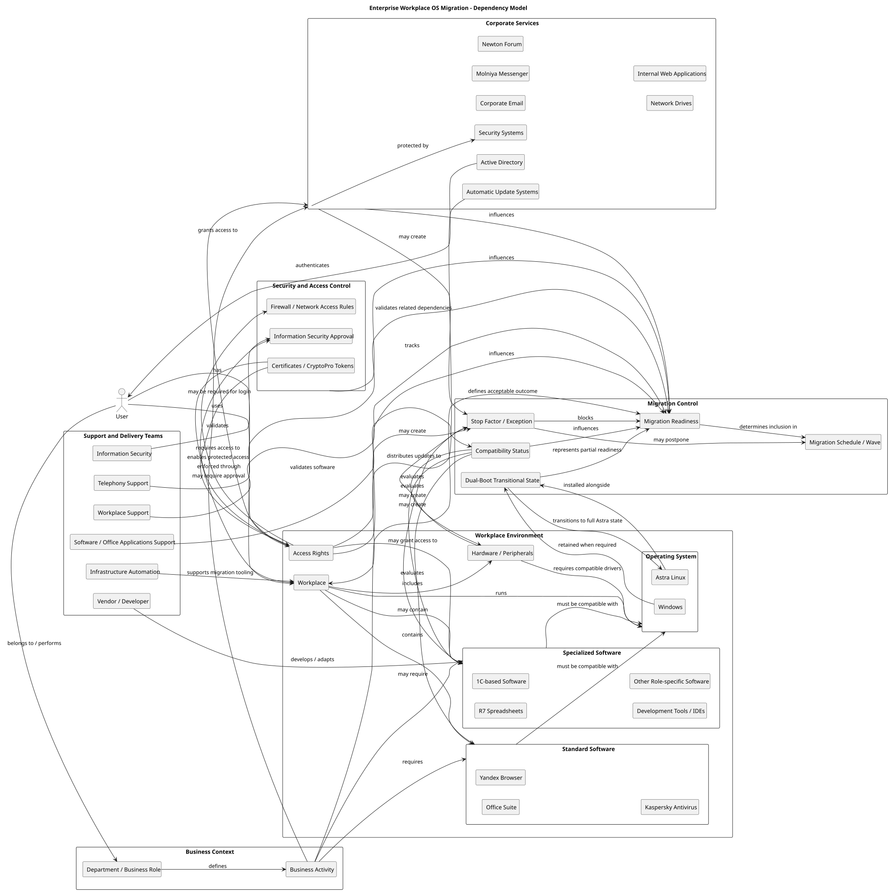
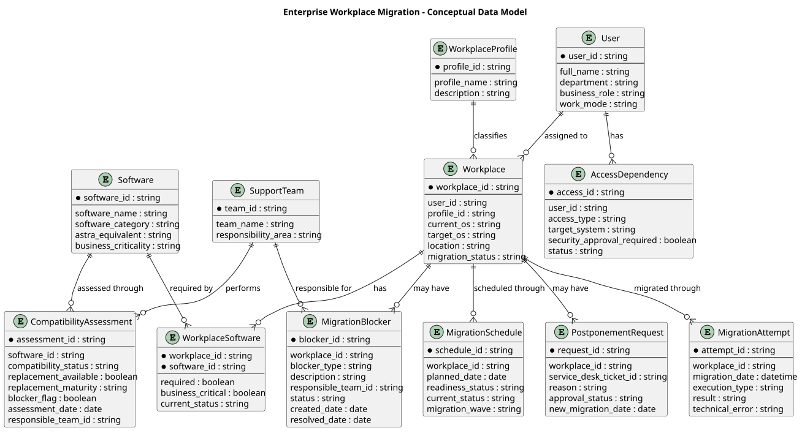
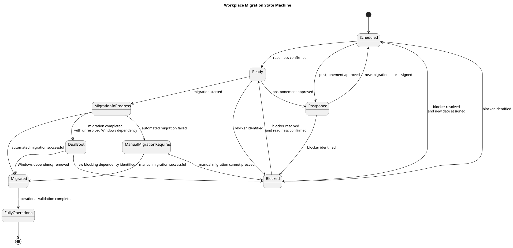
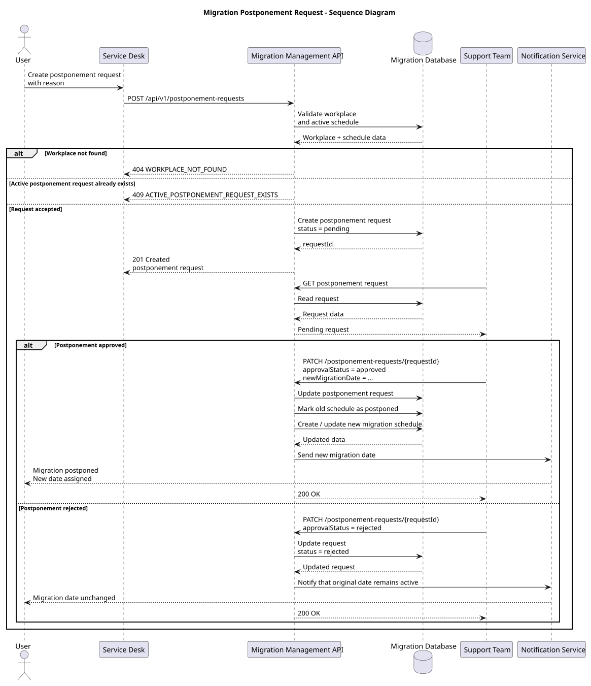
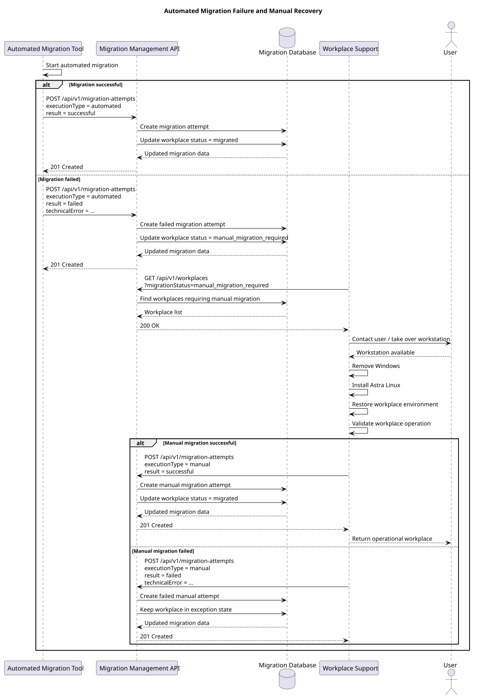

# Enterprise Workplace OS Migration

> Sanitized reconstruction of a large-scale enterprise workplace migration from Microsoft Windows to Astra Linux in a banking environment.


---

## Overview

This repository presents a structured system-analysis reconstruction of a real enterprise workplace migration initiative.

The original programme focused on transitioning employee workplaces from Microsoft Windows to Astra Linux while preserving business continuity, required software, corporate access, security controls and operational supportability.

The migration itself was largely automated. The analytical challenge was not simply OS installation, but the management of dependencies, readiness, exceptions, compatibility constraints, rescheduling and recovery paths across a large enterprise environment.

This repository demonstrates how that real operational process can be formalized into requirements, system models, data structures, API contracts and integration rules.

---

## Key Challenges

The migration had to account for:

- software with incomplete or unavailable Linux equivalents;
- business workflows that depended on Windows-specific functionality;
- standard, remote, restricted and specialized workplace profiles;
- user postponement requests;
- migration blockers and cross-team dependencies;
- automated migration failures requiring manual recovery;
- transitional dual-boot states;
- operational traceability and reporting.

A workplace was not considered successfully migrated solely because Astra Linux had been installed. The target state was an operational workplace capable of supporting the required business activity.

---

## Migration Flow



Simplified process:

```text
Workplace scheduled
        ↓
User notified
        ↓
Postponement requested?
   ┌────┴────┐
   │         │
  Yes        No
   │         │
Reschedule   │
   │         │
   └────┬────┘
        ↓
Automated migration
        ↓
   Successful?
   ┌────┴────┐
   │         │
  Yes        No
   │         │
Migrated   Manual recovery
             ↓
          Migrated
```

---

## System Dependency Model



Migration readiness depends on more than the operating system itself.

A simplified dependency chain:

```text
User
  ↓
Business Activity
  ↓
Required Software / Corporate Services
  ↓
Access + Security + Compatibility
  ↓
Workplace
  ↓
Migration Readiness
```

---

## Data Model



Core entities include:

- `User`
- `Workplace`
- `WorkplaceProfile`
- `Software`
- `WorkplaceSoftware`
- `CompatibilityAssessment`
- `MigrationSchedule`
- `PostponementRequest`
- `MigrationAttempt`
- `MigrationBlocker`
- `AccessDependency`
- `SupportTeam`

One important modeling decision is separating migration planning from actual execution:

```text
MigrationSchedule = planned migration
MigrationAttempt  = actual execution attempt
```

This makes it possible to represent:

- repeated rescheduling;
- failed automated attempts;
- manual recovery;
- migration history.

---

## Workplace Lifecycle



The state model defines allowed transitions such as:

```text
Scheduled
    ↓
Ready
    ↓
Migration In Progress
   ↙                  ↘
Migrated       Manual Migration Required
                       ↓
                    Migrated
```

Invalid transitions are treated as business-state conflicts rather than arbitrary status updates.

---

## Sequence Diagrams

### Postponement Flow



Shows interaction between:

- User;
- Service Desk;
- Migration Management API;
- Migration Database;
- Support Team;
- Notification Service.

### Automated Failure and Manual Recovery



Shows how a failed automated migration is recorded and transferred to Workplace Support for manual recovery.

---

## Requirements

The requirements package is organized as a traceable chain:

```text
Business Rule
    ↓
Functional Requirement
    ↓
Non-Functional Requirement
    ↓
Acceptance Criterion
```

Main documents:

| Artifact | Description |
|---|---|
| [`01-context-and-scope.md`](docs/01-context-and-scope.md) | Scope, boundaries and success criteria |
| [`02-as-is.md`](docs/02-as-is.md) | Current workplace environment |
| [`03-dependency-model.md`](docs/03-dependency-model.md) | Migration dependencies and readiness |
| [`04-business-rules.md`](docs/04-business-rules.md) | Operational decision rules |
| [`05-functional-requirements.md`](docs/05-functional-requirements.md) | Required system/process behavior |
| [`06-non-functional-requirements.md`](docs/06-non-functional-requirements.md) | Reliability, security and operational qualities |
| [`07-acceptance-criteria.md`](docs/07-acceptance-criteria.md) | Verification conditions |
| [`08-requirements-traceability-matrix.md`](docs/08-requirements-traceability-matrix.md) | BR → FR → NFR → AC mapping |
| [`09-migration-data-model.md`](docs/09-migration-data-model.md) | Conceptual data model |
| [`10-workplace-state-model.md`](docs/10-workplace-state-model.md) | Workplace lifecycle and transitions |

---

## SQL

The [`sql/`](sql/) directory contains a simplified PostgreSQL implementation of the conceptual model.

| File | Purpose |
|---|---|
| [`01-schema.sql`](sql/01-schema.sql) | Tables, keys, relationships and indexes |
| [`02-sample-data.sql`](sql/02-sample-data.sql) | Synthetic portfolio data |
| [`03-analysis-queries.sql`](sql/03-analysis-queries.sql) | Analytical and consistency-check queries |

The query set demonstrates:

- `SELECT`
- `WHERE`
- `JOIN`
- `LEFT JOIN`
- `DISTINCT`
- `GROUP BY`
- `HAVING`
- `COUNT`
- `MAX`
- `EXISTS`
- subqueries

Example analytical questions include:

- Which workplaces are blocked by incompatible software?
- Which automated migrations failed?
- Which failed attempts were followed by successful manual migration?
- Which users have multiple workplaces?
- Which workplaces have open blockers but inconsistent migration states?

---

## REST API Design

The [`api/`](api/) directory contains a hypothetical Migration Management API derived from the same domain model.

This API is a portfolio reconstruction and does not represent a real production banking interface.

Main artifacts:

| File | Purpose |
|---|---|
| [`01-api-overview.md`](api/01-api-overview.md) | API scope and responsibilities |
| [`02-endpoints.md`](api/02-endpoints.md) | REST endpoints and HTTP behavior |
| [`03-json-contracts.md`](api/03-json-contracts.md) | Fields, types, nullable/optional rules and validation |
| [`04-integration-rules.md`](api/04-integration-rules.md) | Idempotency, retries, timeouts, concurrency and state consistency |
| [`openapi.yaml`](api/openapi.yaml) | Machine-readable OpenAPI 3.0 contract |

Example endpoints:

```http
GET    /api/v1/workplaces
GET    /api/v1/workplaces/{workplaceId}
GET    /api/v1/workplaces/{workplaceId}/software
GET    /api/v1/workplaces/{workplaceId}/migration-attempts

POST   /api/v1/migration-schedules
PATCH  /api/v1/migration-schedules/{scheduleId}

POST   /api/v1/postponement-requests
PATCH  /api/v1/postponement-requests/{requestId}

POST   /api/v1/migration-attempts

POST   /api/v1/migration-blockers
PATCH  /api/v1/migration-blockers/{blockerId}
```

---

## Integration Design

The integration model covers:

- idempotency;
- duplicate request handling;
- retries;
- timeout semantics;
- stale events;
- event ordering;
- transaction consistency;
- correlation IDs;
- authentication and authorization boundaries.

A core principle is:

> External systems report facts. The Migration Management Service controls business state.

For example:

```text
Automated Migration Tool
        ↓
result = failed
        ↓
Migration Management Service
        ↓
manual_migration_required
```

An external migration tool should not directly set arbitrary internal lifecycle states.

---

## Repository Structure

```text
enterprise-workplace-os-migration/
│
├── docs/
├── diagrams/
│   └── rendered/
├── api/
├── sql/
└── README.md
```

---

## What This Case Demonstrates

This repository demonstrates practical system-analysis work across several layers:

**Requirements engineering**
- scope definition;
- business rules;
- functional and non-functional requirements;
- acceptance criteria;
- traceability.

**System modeling**
- dependency modeling;
- process modeling;
- sequence diagrams;
- state machine;
- conceptual data modeling;
- ERD.

**Data**
- relational schema design;
- many-to-many relationships;
- SQL analysis;
- consistency checks.

**Integration**
- REST;
- JSON contracts;
- OpenAPI;
- error handling;
- idempotency;
- retries and timeouts;
- state consistency.

**Enterprise change**
- dependency management;
- migration readiness;
- operational exceptions;
- cross-team coordination;
- recovery paths.

---

## Disclaimer

This repository is a sanitized reconstruction of a real enterprise migration case.

Internal system names, organization-specific processes, employee data, technical identifiers, infrastructure details and confidential information have been removed, generalized or replaced with synthetic examples.

The repository does not contain original internal documentation, production data, confidential infrastructure information or proprietary source code.

The API, database schema and diagrams are analytical reconstructions created for educational and portfolio purposes.

---

## Author

**Daniel Rogulin**  
System Analyst / Enterprise IT

Focus areas:

- enterprise systems;
- systems analysis;
- integrations;
- infrastructure transformation;
- requirements engineering;
- technical process decomposition.
