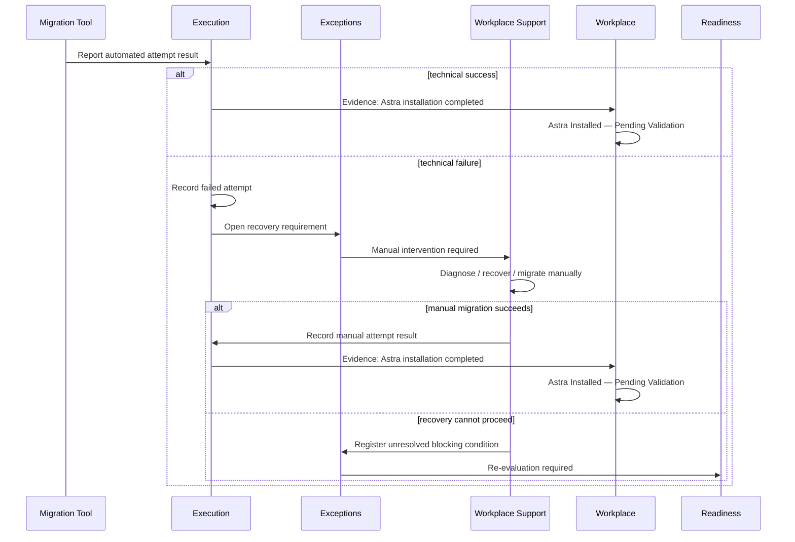
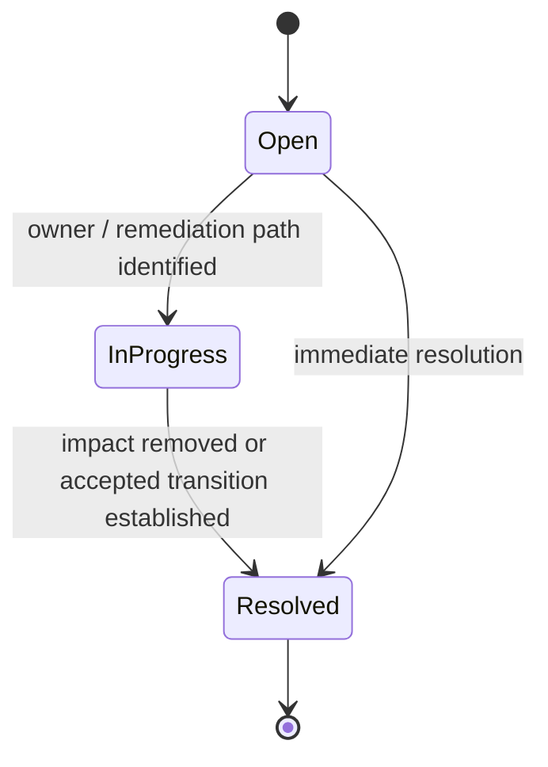
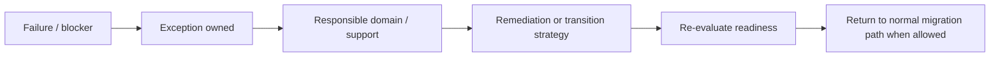

# Exceptions and Recovery Visual Model

This view shows how technical failure becomes an explicit recovery path without collapsing execution, exception and workplace state into one status.

## Blocker lifecycle

`Resolved` means the exception no longer blocks the same path. It does **not** imply that the workplace is now ready or operational. Readiness and operational validation must evaluate their own conditions.

## Recovery loop

See [`blockers-and-recovery.md`](blockers-and-recovery.md).
