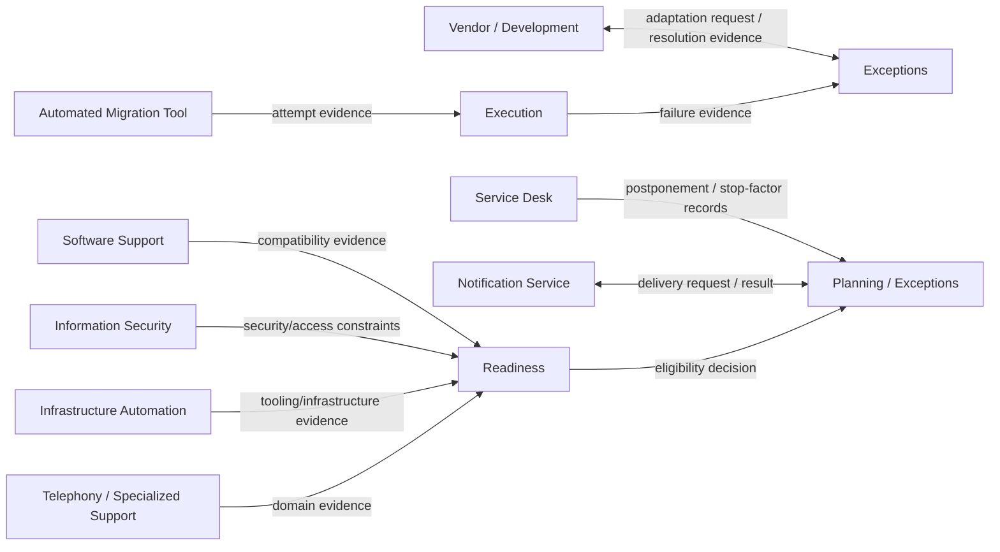

# Integration Boundary Visual Model

This diagram shows **what crosses each ownership boundary**. It intentionally does not model the internals of adjacent corporate systems.



## Boundary rule

```text
external system owns its own fact/capability
        ↓
fact crosses a contract boundary
        ↓
relevant migration owner interprets it
        ↓
canonical migration meaning changes only through that owner
```

Examples:

- the migration tool owns the technical result it observed, but not `Astra Operational`;
- Service Desk owns ticket/workflow evidence, but not the active migration schedule;
- Software Support owns compatibility evidence for its domain, but not aggregate readiness;
- Notification owns delivery behavior, but not the date being communicated.

See [`boundary-contracts.md`](boundary-contracts.md).
