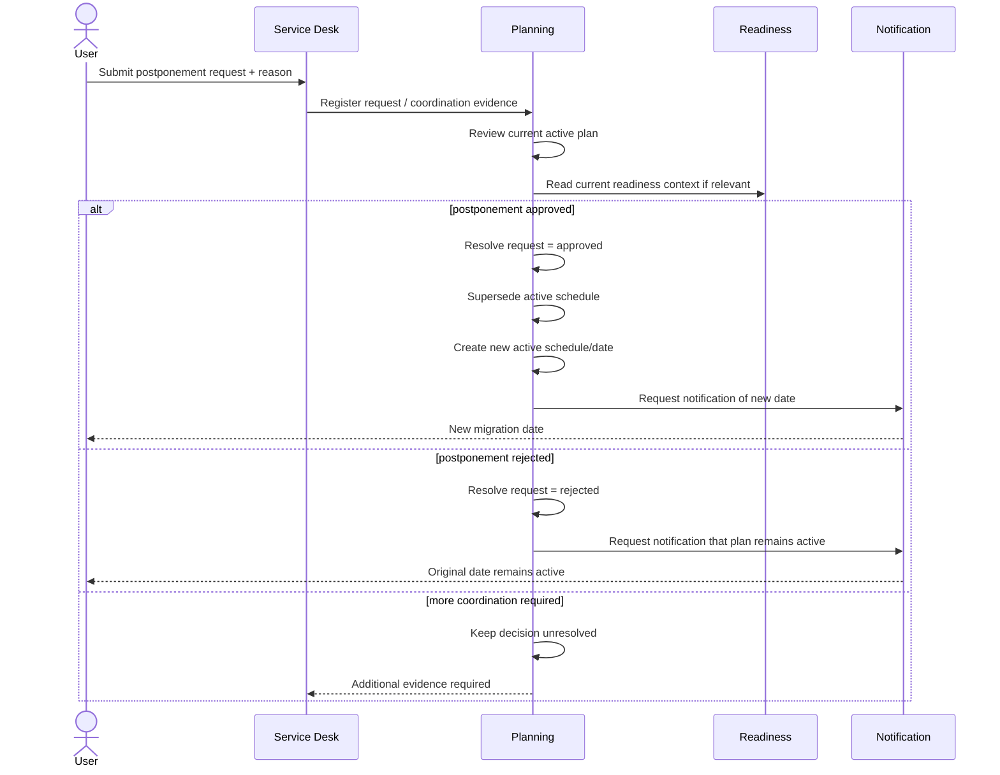
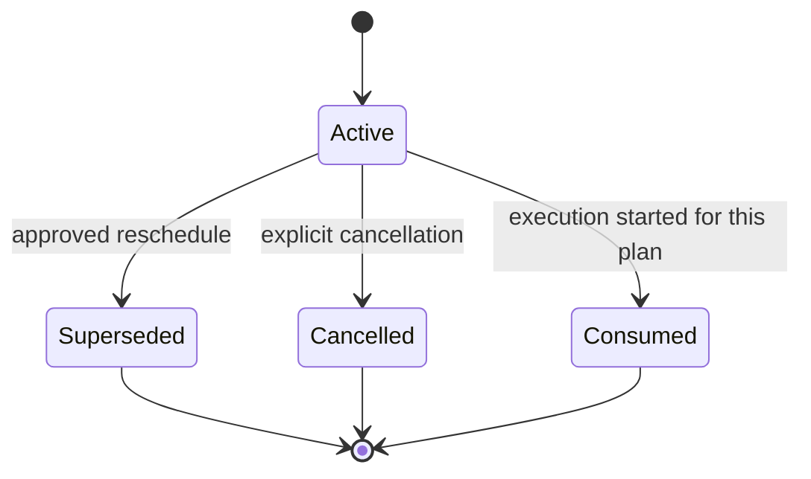

# Planning Visual Model

Planning owns the **intended migration date/wave and postponement decision**, not readiness or execution outcome.

## Postponement flow

The Service Desk is the formal request/coordination boundary. It does not own the canonical migration schedule.

## Schedule lifecycle

A new planned date should create or identify a new active plan rather than rewriting historical intent without traceability.

See [`scheduling-and-postponement.md`](scheduling-and-postponement.md).
