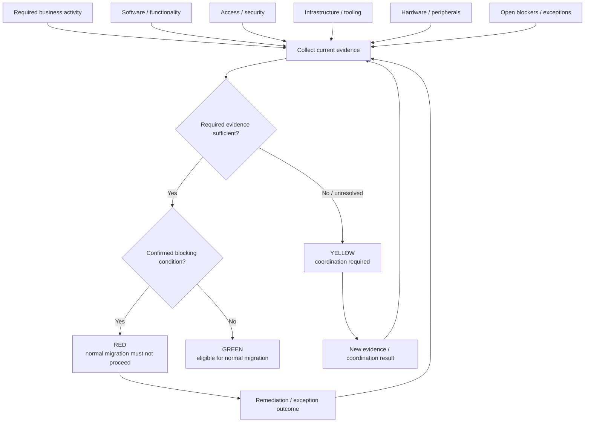
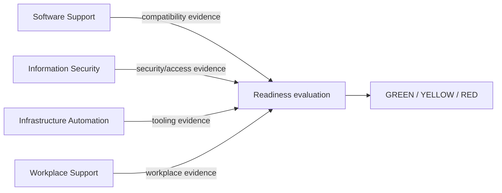

# Readiness Visual Model

Readiness answers one question:

> **May this workplace proceed through the normal migration path now?**

It is a time-sensitive decision over current evidence, not a permanent workplace attribute.

## Evidence and authority

Each external or adjacent domain can be authoritative about its own evidence without owning the aggregate readiness decision.

## Re-evaluation

A previous `GREEN` result may be reopened when material evidence changes. A resolved blocker does not mechanically set readiness to `GREEN`; it removes or changes one input and triggers re-evaluation.

See [`evidence-model.md`](evidence-model.md) and [`decision-model.md`](decision-model.md).
