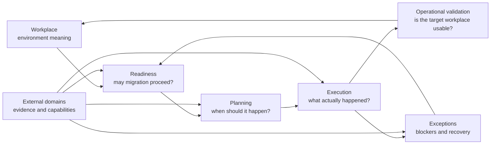
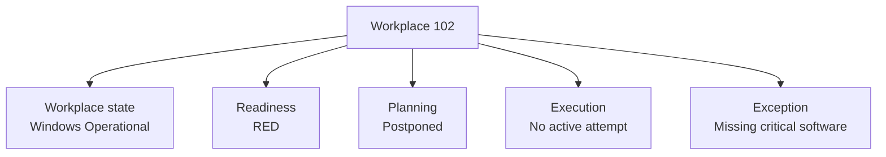
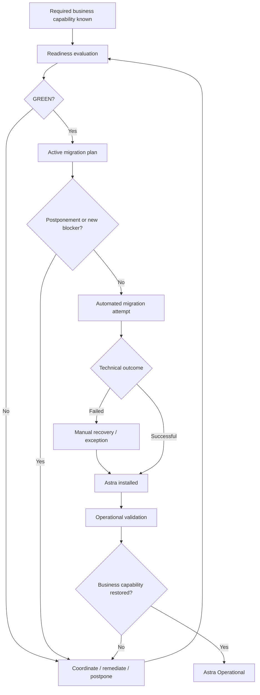

# System Visual Models

This page contains **cross-system synthesis views** for the migration case.

The diagrams do not replace the canonical owner documents. They show how responsibility-owned knowledge connects end to end.

## Responsibility map



The arrows represent **knowledge and decision dependencies**, not one global state machine.

## Independent state dimensions

A single workplace can have several simultaneous states owned by different areas.



These values are not alternatives in one enum. They answer different questions.

## End-to-end migration flow



The important distinction is:

```text
technical execution success
!=
operational migration completion
```

## Where the details live

- [`../workplace/`](../workplace/) — workplace environment and operational state;
- [`../readiness/`](../readiness/) — evidence and eligibility decision;
- [`../planning/`](../planning/) — schedule and postponement;
- [`../execution/`](../execution/) — attempt facts;
- [`../exceptions/`](../exceptions/) — blockers and recovery;
- [`../integrations/`](../integrations/) — external ownership boundaries;
- [`../technical-projection/`](../technical-projection/) — synthetic implementation projection.
