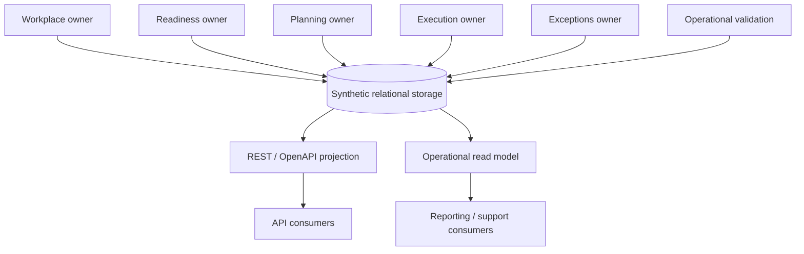
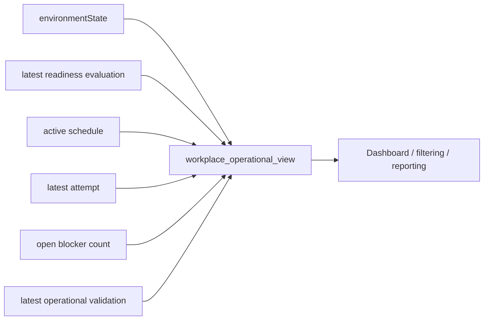

# Technical Projection Visual Model

This page shows how independently owned domain facts may be stored and exposed together without turning the technical layer into the semantic owner.

## Projection from canonical owners



Storage locality does not merge semantic ownership.

## Operational read model



The read model is deliberately denormalized for operational questions. It is **derived knowledge** and must not be used as the authoritative write model for all dimensions.

## API command rule

Prefer owner-specific operations:

```text
reschedule
approve postponement
register attempt
resolve blocker
record operational validation
```

over generic commands such as:

```text
PATCH migrationStatus
```

See [`api/README.md`](api/README.md) and [`data/README.md`](data/README.md).
