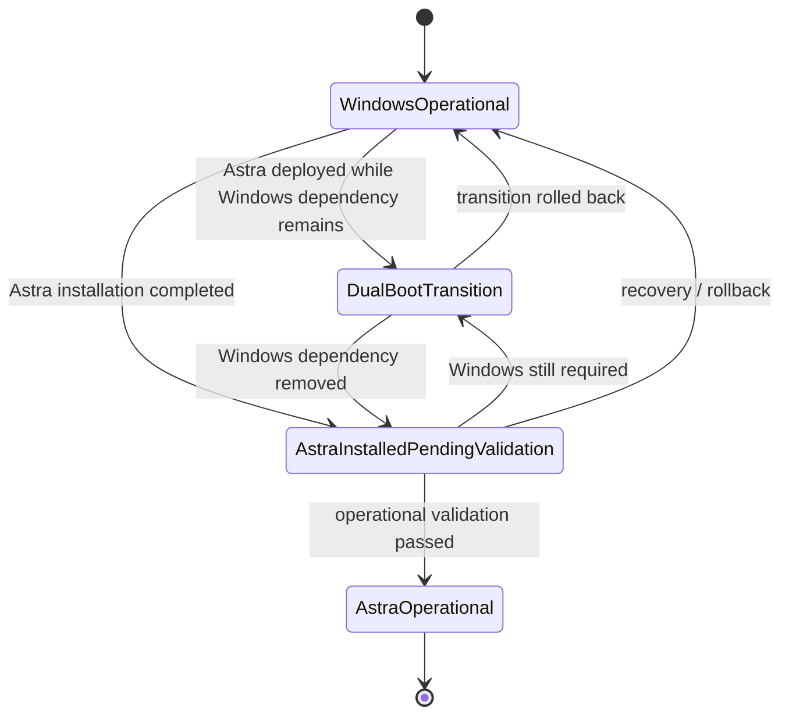

# Workplace Visual Model

This diagram owns only **workplace environment state**.

It intentionally excludes readiness, scheduling, blocker and execution states because those belong to other responsibility areas.

## State meanings

### Windows Operational

The existing Windows-based environment remains the active usable workplace.

### Dual-Boot Transition

Astra Linux exists, but Windows is still required for one or more business scenarios. This is explicitly transitional.

### Astra Installed — Pending Validation

The target OS has been installed, but the system has not yet established that required business capability, access and software are operational.

### Astra Operational

The target workplace environment has passed operational validation and supports the agreed business activity.

## Important non-states

The following are **not workplace environment states**:

- `GREEN / YELLOW / RED` — readiness;
- scheduled / postponed — planning;
- in progress / failed — execution;
- blocked / manual recovery required — exception handling.

See [`states.md`](states.md) for canonical semantics and [`../system/visual-models.md`](../system/visual-models.md) for the cross-system view.
